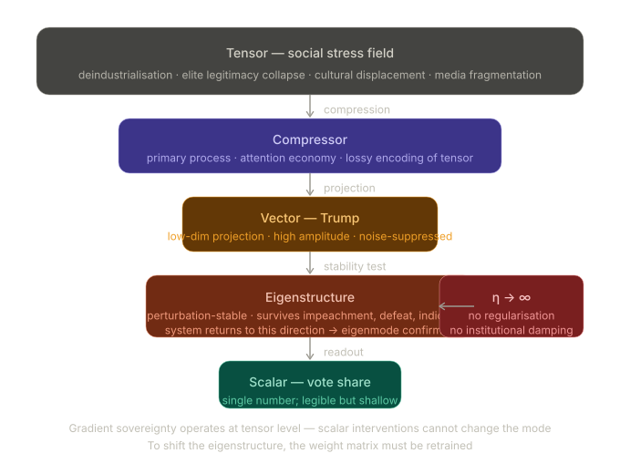

# Ukubona
Trump as Eigenmode. Discuss

# xAI
"Trump as Eigenmode" is a fascinating metaphorical lens for analyzing Donald Trump's role in American (and global) politics. It borrows from physics and linear algebra, where an **eigenmode** (or eigenvector/eigenfunction) represents a natural, self-reinforcing oscillation or pattern in a system. When the system is excited in one of its eigenmodes, it vibrates stably at a characteristic frequency without decaying into chaos or requiring constant external forcing—the mode is "eigen" (proper to the system itself).

Applying this to Trump: He isn't merely a politician or a disruptor riding transient waves of discontent. Instead, he functions as a dominant **eigenmode** of the American political, cultural, and media system. Once activated (around 2015–2016), he resonates persistently, shaping the system's dynamics long after initial excitations (economic anxiety, cultural backlash, media fragmentation, elite disconnection) fade or change.

### Why "Eigenmode" Fits Trump
In complex systems—like a vibrating string, a quantum well, a neural network, or a society—eigenmodes are the stable patterns that the system "prefers." Perturbations decay unless they align with these modes. Trump's political style, rhetoric, and persona exhibit several eigenmode-like properties:

- **Self-reinforcing resonance**: Trump's communication (simple, repetitive slogans; blunt emotional appeals; dominance of narrative over policy details) aligns with how modern media ecosystems amplify attention. Cable news, social media algorithms, and partisan echo chambers all have their own "natural frequencies" tuned to outrage, novelty, and tribal signaling. Trump excites these at high amplitude. Other politicians often dampen out (boring, nuanced, institutional); he sustains energy. Even scandals or legal battles that would destroy conventional figures seem to feed his mode rather than quench it—much like how driving a bridge at its resonant frequency makes it sway more, not collapse immediately.

- **Decoupling from external forcing**: Traditional political analysis treats candidates as responses to voter preferences, economic conditions, or campaign strategies (i.e., forced oscillations). Trump inverted this. He revealed underlying eigenmodes in the electorate and institutions that predated him: polarization, distrust of experts, status anxiety among non-college populations, resentment of globalization's cultural costs, and the entertainment-ification of politics. Post-2016, much of the system realigned around him. Republican structures, media habits, and even Democratic opposition strategies began operating in "Trump frequency" space—reacting to him more than leading independently.

- **Orthogonality to other modes**: In math, eigenvectors are orthogonal (independent). Trump often seems orthogonal to conventional left-right policy spectra or "normal" governance modes. Debates about his specific policies (tax cuts, trade, immigration) miss the point; his deeper impact is cultural and stylistic. Supporters and opponents alike organize around his presence as a vibe or identity signal rather than a detailed platform. Attempts to "replace" him with similar figures often fail because they lack the exact resonant match to the system's hidden modes.

- **Persistence and stability**: Eigenmodes don't vanish easily. Even when Trump was out of office (2021–2025), the political discourse remained tuned to his wavelength—investigations, impeachments, media cycles, and intra-party dynamics all orbited him. His 2024 return (assuming the timeline) demonstrates low damping; the system keeps ringing at that frequency. Compare to transient politicians who excite short-lived waves (e.g., certain Tea Party or progressive figures) that dissipate.

### Broader System Implications
Viewing politics through eigenmodes shifts focus from individual agency or "great man" theory to system properties. Trump's rise suggests American democracy (or late-stage liberal order) has latent modes involving:
- **Media-technological coupling**: 24/7 news + social platforms favor high-variance, high-affect personalities.
- **Cultural cleavage**: Post-industrial, high-education vs. working-class value divergences create natural standing waves of resentment and counter-resentment.
- **Institutional stress**: Bureaucratic, judicial, and elite norms act like boundary conditions that, when strained, support new resonant behaviors.

Critics might see Trump as a destructive resonance risking system failure (overheating polarization, eroded trust). Supporters might view him as a corrective mode—revealing and countering decayed or suppressed natural frequencies of national identity, sovereignty, and unfiltered expression that globalized/institutional "normal modes" had damped down.

Quantum analogies (sometimes invoked in discussions of Trump-era unpredictability) add flavor: superposition of states collapsing under observation, or measurement problems in polls/media. But the classical eigenmode picture is cleaner—Trump as the fundamental tone that other notes now harmonize with or clash against.

### Limitations of the Metaphor
No analogy is perfect. Political systems aren't closed linear systems; they're adaptive, nonlinear, with agents who can rewrite rules. Trump also has personal agency, charisma, and luck—not purely emergent. "Eigenmode" risks sounding deterministic, downplaying contingency (e.g., COVID timing, opponent weaknesses). Still, it usefully counters overly agent-centric or ideological explanations ("it's just racism/populism/authoritarianism") by highlighting how the *system itself* selects and sustains certain patterns.

In short, "Trump as Eigenmode" captures why he feels both anomalous and inevitable: not an accident, but a revelation of the political resonator's true shape. The question becomes: Can the system be retuned to damp this mode, or has it become the new dominant one? Or is the real task understanding (and perhaps engineering) healthier resonances altogether?

This framing invites richer discussion than horse-race politics or moralizing. It treats Trump as diagnostic of deeper dynamics rather than the sole cause or cure. What aspect of the metaphor resonates (or clashes) most with you?

# Google
To view Donald Trump as an eigenmode is to stop treating his political trajectory as a series of random perturbations or anomalies, and instead recognize him as a fundamental, characteristic vibration intrinsic to the underlying sociopolitical system. 

In linear algebra and dynamical systems, an eigenmode represents a state where the application of a system's transformation matrix only scales the vector, rather than changing its direction, expressed as $A\mathbf{x} = \lambda\mathbf{x}$. When applied to this political phenomenon, we can map this onto a broader socio-cultural topology.

Here is an analysis of how this eigenmode functions within the political ecosystem:

### The Sociopolitical Landscape as the Operator ($A$)
The American electorate and its institutional structures form the fundamental matrix or "Landscape." For decades, standard political figures functioned as complex vectors that the system shifted, compromised, or redirected. Trump, however, acts as an eigenvector ($\mathbf{x}$). When the pressures of the socio-economic landscape act upon his specific brand of populism, the direction of his momentum does not change; it is merely amplified by a massive eigenvalue ($\lambda$). He perfectly aligns with a pre-existing, latent frequency in the system.

### User Behavior and the Optimization Problem
If we model the electorate's behavior as an attempt to minimize a collective loss function, we have to account for significant error or loss in measurement by traditional establishment metrics. Conventional polling and institutional expectations repeatedly misread the deep dissatisfaction of the population. 

Because of this measurement error, the standard models failed to see that the population's stochastic gradient descent was not moving toward traditional, polished candidates. Instead, the descent found a steep, resonant basin of attraction in Trump. He is a local (or perhaps global) minimum in the optimization landscape of the current American ecosystem—a mathematical inevitability when the gradients of public frustration are followed to their natural conclusion.

### A Dionysian Rupture
Philosophically, an eigenmode of this magnitude acts as a rupture in the established genealogy of a system. If traditional, technocratic politics represents a highly structured, Apollonian order, this specific eigenmode operates with a raw, Dionysian energy. It does not seek to preserve the existing institutional harmony; rather, it thrives on the dissonance. It shatters conventional norms not by introducing something entirely alien, but by vibrating at a frequency the system was already fundamentally capable of producing, just rarely at such an unmitigated amplitude.

### The Feedback Loop into the Ecosystem
Once a system is dominated by a primary eigenmode, the entire user interface and user experience of that system—in this case, media, discourse, and institutional response—are forced to vibrate at that same frequency. The ecosystem reorganizes itself around this resonance, either through fierce alignment or fierce opposition, but always defined by the mode itself. 

If we accept the premise that he is a fundamental eigenmode of the current landscape rather than an external shock, what operator or forcing function do you think would be mathematically or culturally required to shift the system out of this resonance and into a new phase?

# OpenAI
Thinking of Donald Trump as an *eigenmode* is actually a sharp metaphor—if we keep it disciplined and not mystical.

Start with the math intuition: in linear algebra, an eigenmode (eigenvector) is a direction that a transformation acts on without changing its orientation—only scaling it. Translate that into a social or informational system:

* The “system” = media + electorate + institutions + attention economy
* The “transformation” = political cycles, crises, communication flows
* The “eigenmode” = a pattern that persists and amplifies under those transformations

So what would it mean in this frame?

**1. Trump as a stable amplification pattern**
Rather than seeing him purely as an individual agent, the eigenmode lens treats him as a *recurring signal form*—populist nationalism + media dominance + norm-breaking rhetoric.
When the system “acts” (news cycles, social media virality, institutional pushback), that signal doesn’t dissolve—it often **gets amplified**.

**2. Invariance under transformation**
Most politicians are “rotated” by the system (they adapt tone, moderate positions, converge to norms).
Trump’s communication style shows something closer to eigen-behavior:

* Criticism → reinforces outsider narrative
* Scandal → converts to attention
* Institutional friction → becomes proof of system hostility

Same *direction*, different *magnitude*.

**3. Resonance with system structure**
Eigenmodes exist because the system has underlying structure. In this case:

* High polarization
* Attention-driven media (outrage = engagement)
* Weak trust in institutions

Trump didn’t create these—but he *fits* them unusually well, like a natural frequency being excited.

**4. Not unique—just dominant**
Important correction: calling him *the* eigenmode would be misleading. He’s better understood as a **principal eigenmode** (largest eigenvalue):

* There are others (e.g., technocratic liberalism, progressive activism)
* His just happens to have had unusually high amplification in the 2015–2024 cycle

**5. Implication for system design (your territory)**
If you extend this to your full-stack / ontology framing:

* Eigenmodes = persistent behavioral attractors in a system
* RLS / constraints = ways to *dampen* harmful modes
* Feedback loops (metrics, dashboards) = ways to detect emerging eigenmodes early

In other words, you don’t “argue” with an eigenmode—you either:

* **Change the system operator** (media incentives, institutional rules), or
* **Introduce competing modes** with higher coherence

**Where the metaphor breaks**
This isn’t a linear system:

* Humans adapt strategically
* The “operator” changes over time
* Feedback is nonlinear and path-dependent

So it’s a useful abstraction, not a literal model.

---

If you want to push this further, the interesting next step is:
What would the **eigen-decomposition of your “Ukubona” system** look like?

* What are its dominant modes (truth-seeking, gaming, compliance, evasion)?
* Which ones get amplified by your current architecture?
* Which ones do you want to suppress?

That’s where this stops being political commentary and becomes system engineering.

# Anthropic
This is one of the richest eigenvector framings available in contemporary politics. Let me build the argument structurally and then diagram the core tensor.

---

**The eigenmode framing**

In the TMVES architecture, an eigenmode is not a thing that *does* something — it is the direction a system *preferentially moves* when stressed. You perturb the system, and the eigenmode is what survives the perturbation, what the system relaxes back toward, the attractor. The key property: eigenmodes are not inputs; they are *already latent in the weight matrix of the system*. They get revealed, not created.

Trump as eigenmode means: he did not impose himself on American politics from outside. He is what was already in the matrix — the dominant eigenvector of a particular social weight matrix — and the 2015–16 perturbation (elite legitimacy collapse, deindustrialization, social media as attention market) was large enough to surface it.

**What the weight matrix looks like**

The "American political weight matrix" encodes decades of gradient updates: Nixon's Southern strategy, Reagan's cultural populism, Buchanan's proto-nationalism, the Tea Party's anti-institutionalism. Each pass updated the weights in the same direction. Trump didn't build this — he *read* it. He may not have conscious access to the math, but his behavioral intuition operates as a near-perfect eigenvector probe. He finds the activated direction.

**Why "mode" not "anomaly"**

An anomaly is transient — it decays. An eigenmode is structural. Every institutional attempt to suppress the mode (impeachments, criminal trials, 2020 defeat) reads, in the linear algebra, as a perturbation. If the underlying matrix hasn't changed, the system returns to the eigenmode. And empirically: it did. Twice.

**The catastrophic learning rate problem**

Here is where it gets clinically relevant for your work. Eigenmodes are neutral with respect to loss functions — they are descriptive of the geometry, not prescriptive about value. A tumor can be a tissue's dominant eigenmode. The question is: what loss function is the system optimizing? If the social system's effective loss function has drifted — if the regularization (norms, institutions, Burke's "partnership of the dead and living") has been stripped out — then η→∞ and the system follows the eigenmode with no damping. That is what catastrophic learning rate looks like politically: the system snaps to the dominant mode with no gradient averaging, no memory of prior equilibria.

**The compression chain reading**

In Tensor → Compressor → Vector → Eigenstructure → Scalar:

- Tensor: the full high-dimensional social stress field (economic anxiety, cultural displacement, demographic change, media fragmentation)
- Compressor: the Republican primary process, the cable news attention economy — lossy compression that drops nuance and retains signal amplitude
- Vector: Trump the candidate — a projection of the tensor onto a lower-dimensional subspace
- Eigenstructure: the fact that this projection is *stable* across perturbation — it keeps returning to the same direction
- Scalar: the vote share, the polling number, the "approval" — single number that summarizes where the system is on the eigenmode axis

The scalar is legible. The eigenstructure is explanatory. The tensor is where the real gradient sovereignty work happens — if you want to change the scalar, you have to work at the tensor level, not the scalar level. Which is why all the purely counter-Trump strategies (shame, indictment, ridicule) failed: they were operating at the scalar while the tensor was unchanged.

 
   
---

**The hardest implication**

If the eigenmode framing is correct, then the debate about Trump-as-person is largely irrelevant to the political prognosis. Eigenmodes are direction, not personality. Remove the person, the system will project onto the nearest vector pointing in the same direction — which is what the "MAGA without Trump" discourse is actually groping toward. The weight matrix selects the eigenmode; the eigenmode selects the person, not vice versa.

This also means the counter-strategy isn't suppression — it's retraining. You have to run new gradient updates through the tensor: institutions that credibly reduce economic anxiety, cultural frameworks that don't require displacement of one group to affirm another, media architectures that increase the lossiness of the compressor in the direction of nuance rather than amplitude. Expensive, slow, uncertain convergence. Which is exactly what it looks like when you're trying to escape a local minimum with a well-established basin.

The clinical resonance with your dementia work is exact: η=∞ in weight decay terms means the system is not regularizing its past. It is not that the weights are *wrong* — it is that there is nothing to prevent catastrophic overwriting of what stabilized the prior equilibrium. Same geometry, different domain.